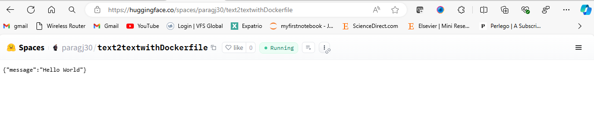
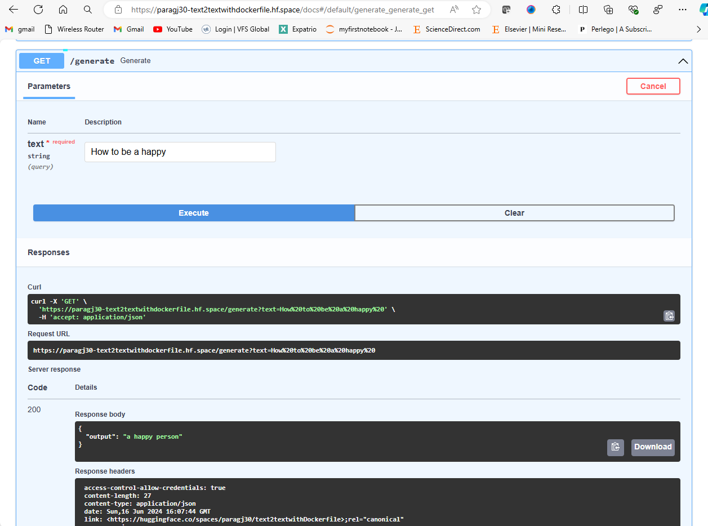

title: Text2textwithDockerfile

emoji: 🏃

colorFrom: yellow

colorTo: purple

sdk: docker

pinned: false

license: mit

This GenAI project is about building a generative AI application and deploying it on Hugging Face Spaces through FASTAPI Swagger UI. Here are the steps covered in the video:

- Create a generative AI application:
    1. Use Fast API to create an end-to-end project.
    2. Update requirements.txt file with all the required libraries.
    3. Create a text generation application using llm models and Transformers library.
    4. Use pipeline from Transformers to call multiple llm models.
    5. Create a Dockerfile to containerize the application.
    6. Deploy the application on Hugging Face Spaces.

 

